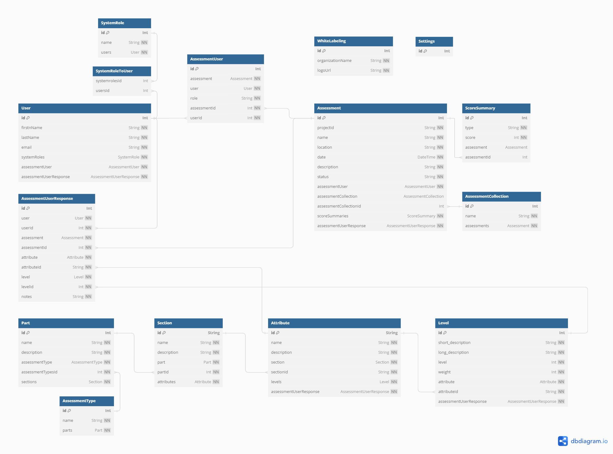

# EMPACT

**EMPACT: The Environment and Maturity Program Assessment and Control Tool** is an Open Source implementation of the IP2M METRR Environmental and Maturity evaluation model. The IP2M METRR model was developed by the US Department of Energy in collaboration with Arizona State University. EMPACT is an open source project intended as a collaborative effort by the greater earned value community and is not at this time funded or endorsed by ASU. 

This project is sponsored by the US Department of Energy's Office of Project Management, which is contributing contract developer resources.

This tool is based on the originally published research findings in the DOE-funded study but is developed independently from ASU's proprietary IP2M METRR tool and does not reuse any code from that tool. Development priorities and features are derived from practical lessons learned from use of ASU's IP2M METRR tool.

## Current Status

A proof of concept framework has been developed allowing for a single NextJS Web codebase to be deployed as a locally installable fully offline Windows application and as a Web Server with backend database functions for shared usage. Continuous Integration / Continuous delivery has been designed and deployed with Github Actions so that any merge to the 'main' branch of this project automatically builds and publishes a Docker container for the web site and an MSI and EXE installable application.

Additional systems need to be added to allow for the website development and prototyping the database and backend interactions, as well as the web security layer. Once the framework is fully fleshed out, we can begin creation of the actual web interfaces and functionality.

## Licensing

This is Open Source software licensed under [CC BY 4.0](https://creativecommons.org/licenses/by/4.0/). See LICENSE file for more information.

Under the CC BY 4.0 license, you are free to:

- Share — copy and redistribute the material in any medium or format for any purpose, even commercially.
- Adapt — remix, transform, and build upon the material for any purpose, even commercially.
- The licensor cannot revoke these freedoms as long as you follow the license terms.

Under the following terms:

- Attribution — You must give appropriate credit, provide a link to the license, and indicate if changes were made. You may do so in any reasonable manner, but not in any way that suggests the licensor endorses you or your use.
- No additional restrictions — You may not apply legal terms or technological measures that legally restrict others from doing anything the license permits.
Notices:
- You do not have to comply with the license for elements of the material in the public domain or where your use is permitted by an applicable exception or limitation.

No warranties are given. The license may not give you all of the permissions necessary for your intended use. For example, other rights such as publicity, privacy, or moral rights may limit how you use the material.

## Development Objectives

- A single codebase that can be run as an offline app or scalable web service with hundreds of users, as simply as possible, avoiding the need for installation of software like Docker on end user systems and without any other dependencies for the end user.
- Secure, maintainable, safe code written in type safe modern programming languages that follow best practices. In this case, Typescript and NextJS for the website and UI portions, with operating system interactions and local installation handled in Rust.
- Leverage the existing public research and models developed with public funding for IP2M METRR - don't reinvent the wheel
- Don't infringe on any intellectual property owned by ASU - this is a new project not building on any existing code
- Full backwards compatibility with IP2M METRR databases and models, allowing for smooth and seamless data migration to EMPACT
- Full replacement functionality for IP2M METRR allowing facilitated assessments in a variety of contexts, implementing lessons learned from use of the ASU tool
- A strong reporting platform that can be iterated on to provide extensive in-app functionality as well as export data for processing in other systems

## Software Approach

Creating a tool with a reusable codebase that can be run as a modern web server with appropriate security considerations and also run as a fully offline local application installable with a standard Windows MSI installer is a genuine software challenge that pushes the capabilities of even modern software frameworks and tools.

After researching available options, and thanks to new advances in tools over the last few years as larger companies begin to publish parallel web and desktop versions of their applications (like Teams, Slack, and others), this is now possible. Unlike those applications, this tool needs to be able to run fully offline rather than connecting to an external server, so an additional layer of complexity is needed.

Here is the approach that will be followed:

- When running as a scalable website, the server will run in a Docker container with a Typescript NextJS web app with frontend user interfaces build in TailWindCSS with ShadCN/UI and the backend implemented with NextJS API routes. The API routes will connect to a SQL server using the Prisma ORM. An authentication and authorization layer will be implemented in NextJS Middleware, leveraging AuthJS for authentication, including both "built-in" and SSO based authentication with support for OpenID Connect or SAML authentication. Particular care will be taken to provide "out-of-the-box" configuration options for common SSO providers used by government agencies such as Microsoft and Login.gov.
- When running as a local application, the server will instead run as a "Tauri" application, which is written in Rust. The application will use the same NextJS frontend UI, this time compiled as a static website with no authentication and authorization layer. Instead of API routes, database functionality will leverage Tauri's ability to call local Rust functions which will interact with a local SQLite database, also using the Prisma ORM.
- Keeping the user interface code and database model as shared code between the local and web versions of the application will reduce development time and ensure the two systems maintain the same core functionality.

### Why these technologies?

- TypeScript is the strongest language for web-development, with the ability to use the extensive modern JavaScript web development ecosystem with an added layer of type safety for ease of development and improved security.
- NextJS offers the ability to create a single web application in one language with both frontend and server functionality, while also having the ability to pre-compile as a static site for use in an offline environment. This allows security on the web while maintaining native-like performance in the local application.
- TailwindCSS and ShadCN/UI are style and UI frameworks that allow for rapid development of a good looking, responsive web application.
- Rust and Tauri. Rust is a modern low level language with strong security elements, and has recently been endorsed by the White House as a language of choice for government application development. Tauri allows us to use a TypeScript website for the best interface experience while leveraging Rust functions for locally running code that needs higher performance and security. Tauri also gives us the ability to compile the web and local code into a single installable file for multiple platforms.

## Contributing

This is an open source project and intended as a collaborative effort. Especially if you or your organization is using this software to facilitate reviews or otherwise benefit, there is an informal expectation that you give back to the greater earned value community by contributing to the codebase and collaborating on this project.

## Code Structure

The codebase is organized as follows, with files relating to the whole project at the parent level and subfolders for specific components:

- /src-tauri: The code used for the Tauri local application, including the Rust functions for interacting with the database and configuration for the Tauri app.
- /web: The NextJS application to be run on the server, containing the UI, API routes, and security layers. The UI is written in a way that works for both platforms, that is to say it calls generically named functions that use API calls in the web version and use Rust functions in the local version.
- /web_static: A seperate NextJS website containing configuration for the static export required for the Tauri app. UI code in this folder is copied in from the web folder and should not be edited. In general this folder shouldn't need to be edited.

## Database Structure

See the [Prisma Schema](https://github.com/empact/EMPACT/blob/main/prisma/schema.prisma) for more details on the database schema, a diagram is below:

## Installation

There are several approaches available to use this tool, described below.

### Standalone usage

Simply download and run the application installer provided in the Releases section of the Github Repository here: [https://github.com/empact/EMPACT/releases](https://github.com/empact/EMPACT/releases). The tool can be installed and run offline, with data stored on your local machine. Data can be exported using the export tools to provide it to others.

Advantages to this approach:

- No need for an external server or any database configuration
- No need for an internet connection after initial installation
- Simplified interface without user management or other complexity included in a multi-user system

Disadvantages to this approach:

- Single user, no group assessments supported
- Requires installation rights on your local machine
- Windows only, no MacOS support at this time (if you are willing to sponsor development costs for MacOS support, please contact us)

### Server installation with external MSSQL or PostGreSQL databases

This is the reccomended approach for a production level application, and involves installing the server Docker container and configuring it to point to an external PostGreSQL or MSSQL database that you own and manage - likely one that you use for other applications already. See the [Installation Guide](https://github.com/cahaseler/EMPACT/INSTALL.md) for more details.

Advantages to this approach:

- Multi-user assessments supported, along with appropriate roll-up reporting
- Browser based web application that can be accessed from any computer with network access to the server, over the internet or an internal network
- No operating system installation required, supports MacOS and other non-Windows platforms
- Data is stored in your existing managed database solutions, making it available to other analytics platforms you may have, and providing your data with existing redundancy and security controls
- Users can leverage single sign on via your existing authentication solution

Disadvantages to this approach:

- Requires server configuration and setup
- Requires setting up the external database and opening appropriate connections between the EMPACT server and your database
- No offline functionality

### Server installation with included PostGreSQL database docker container

This allows you to set up EMPACT as a standalone server running both the EMPACT container and a PostGreSQL database. See the [Installation Guide](https://github.com/cahaseler/EMPACT/INSTALL.md) for more details.

Advantages to this approach:

- Multi-user assessments supported, along with appropriate roll-up reporting
- Browser based web application that can be accessed from any computer with network access to the server, over the internet or an internal network
- No operating system installation required, supports MacOS and other non-Windows platforms
- No existing systems or databased are needed, this is an all-in-one solution that includes both the database and the EMPACT server with no external connections
- Users can leverage single sign on via your existing authentication solution

Disadvantages to this approach:

- Requires server configuration and setup
- Database remains on the same server as EMPACT, meaning you will need to configure your own backups and security controls to ensure data retention
- No offline functionality
