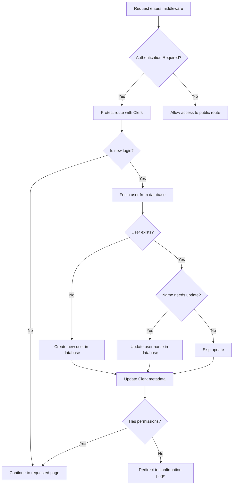

# Clerk Migration Notes

## Introduction

This document outlines our migration from next-auth to Clerk for authentication in our Next.js application. 

Our application was initially built with next-auth, implementing a temporary credentials-based authentication system for testing purposes. As we prepared to move to a production environment, we reassessed our authentication needs with the project's goals in mind.

Given that our application is an open-source tool intended for distribution to various organizations, we determined that outsourcing account management and SSO configuration to a specialized third-party service would be more efficient than building and maintaining these features in-house.

Clerk emerged as the optimal solution for several reasons:
- Strong integration with Next.js
- Generous free tier for organizations with limited budgets
- Comprehensive SSO capabilities with a security-first approach
- Flexibility for end users to either configure their own SSO provider or use username/password authentication with MFA

This decision particularly benefits our target users who may not have dedicated development teams and prefer a configurable, plug-and-play authentication solution that requires minimal technical setup.

## What is Clerk?

Clerk is a complete authentication and user management solution designed specifically for modern web applications. It provides a set of components and APIs that make implementing secure authentication straightforward while offering a polished user experience.

Key features of Clerk include:
- Pre-built authentication components that can be customized to match application design
- Support for multiple authentication methods (email/password, social logins, SSO)
- Multi-factor authentication options
- User management dashboard for administrators
- JWT-based session management
- Webhook integrations for connecting with other services
- SDK support for various frameworks, with first-class support for Next.js

Clerk abstracts away much of the complexity involved in authentication, allowing developers to focus on building core application features rather than maintaining authentication infrastructure.

## Dependency Upgrades

The migration to Clerk required several key dependency changes in our Next.js application:

### Next.js Upgrade to Canary

A significant change was upgrading to the canary version of Next.js 15. This upgrade was specifically required to enable the Node.js runtime in the middleware, which is essential for our authentication flow:

- The Node.js runtime in middleware allows us to interact with the database directly from middleware
- This capability is used to load user permissions data from the database into Clerk tokens
- This approach replaces custom logic that was previously implemented in our next-auth login flow

While we could potentially downgrade to a stable Next.js version, doing so would require adding an additional API endpoint to interact with Prisma. This would increase complexity and reduce performance by adding an extra network hop. Since this is a pre-production application, using the Next.js canary version is an acceptable trade-off, with the expectation that the Node.js runtime for middleware will be included in stable releases in the near future.

### Other Dependency Changes

- **Prisma**: Updated from v5.21.0 to v5.22.0
- **next-auth**: Removed completely and replaced with Clerk
- **@clerk/nextjs**: Added as a new dependency

## Key Implementation Changes

The migration from next-auth to Clerk required several implementation changes to ensure a smooth transition while maintaining compatibility with existing code. Two critical components were modified to support this migration: the middleware and the authentication adapter.

### Middleware Implementation

The middleware is a crucial part of our authentication flow, responsible for:

1. **User Authentication**: Protecting routes that require authentication
2. **Data Synchronization**: Syncing user data between Clerk and our database
3. **Session Management**: Ensuring user permissions are available in the Clerk session token

The middleware leverages Next.js 15 canary's Node.js runtime to interact with the database directly, allowing us to:

- **Create Users**: When a user signs in through Clerk for the first time, a corresponding record is created in our database
- **Update User Information**: When user details change in Clerk (like name changes), we update our database to reflect these changes
- **Synchronize Permissions**: We load permission data from our database into Clerk's session tokens, making this data securely available client-side for better performance

This synchronization only happens on initial login, minimizing performance impact while ensuring that permission data is always up to date.

#### Middleware Flow



The middleware flow demonstrates how user data is synchronized between Clerk and our database, particularly focusing on:
- Initial user creation when first logging in through Clerk
- Updating user information when it changes in Clerk
- Loading permissions from the database into the session
- Redirecting users without permissions to a confirmation page

Key middleware functions include:
- `fetchUserFromDatabase`: Retrieves user data with associated roles and permissions
- `createUserInDatabase`: Creates a new user record when a user first logs in through Clerk
- `updateUserNameInDatabase`: Updates user information if it's changed in Clerk
- `updateClerkMetadata`: Stores database ID and permissions data in Clerk's user metadata
- `shouldConfirmRegistration`: Redirects users with no permissions to a registration confirmation page

### Authentication Adapter

To minimize changes to the existing codebase, we created an authentication adapter that maintains compatibility with code that previously used next-auth:

```typescript
// auth.ts
export async function auth() {
    const clerkSession = await clerkAuth()
    const clerkSessionClaims = clerkSession?.sessionClaims as CustomJwtSessionClaims
    
    const session:Session = {
        user:  {
            id: clerkSessionClaims.metadata.databaseId?.toString() ?? "",
            email: clerkSessionClaims.user.email ?? "",
            last_name: clerkSessionClaims.user.last_name,
            first_name: clerkSessionClaims.user.first_name,
            name: clerkSessionClaims.user.name,
            systemRoles: clerkSessionClaims.metadata.systemRoles ?? [],
            assessmentUser: clerkSessionClaims.metadata.assessmentUser ?? [],
            assessmentCollectionUser: clerkSessionClaims.metadata.assessmentCollectionUser ?? [],
          }
    }
    
    return session
}
```

This adapter:
- Is located in the same file path where next-auth was previously configured
- Exports an `auth()` function with exactly the same return type as next-auth
- Pulls data from the Clerk session instead of next-auth
- Ensures existing components and code can continue to function without modifications

By implementing this adapter pattern, we were able to migrate to Clerk with minimal changes to the codebase, allowing us to leverage Clerk's features while maintaining backward compatibility.

## New Components and Pages

The migration to Clerk required creating new components and pages to replace the next-auth functionality. These components take advantage of Clerk's pre-built UI components while maintaining our application's design patterns.

### Authentication Pages

#### Sign-In Page

A new sign-in page was created that utilizes Clerk's pre-built `SignIn` component. This page maintains our application's existing layout and branding while leveraging Clerk's authentication UI. The page includes our welcome message, security notice, and embeds the Clerk sign-in component.

#### Sign-Up Page

Similar to the sign-in page, a sign-up page was created using Clerk's `SignUp` component, allowing new users to register with our application.

#### Confirmation Registration Page

A new page was added to handle users who sign up but don't yet have any assigned permissions in the system. Users are redirected to this page by the middleware when they've successfully authenticated with Clerk but don't have any roles or permissions in the database yet. This page displays a message informing users that they will receive access to their assessments soon and providing guidance on whom to contact if they're expecting immediate access.

### Navigation Component Updates

The navigation component was updated to integrate Clerk's `UserButton` component and reorganize user-related actions:

- Integration of Clerk's `UserButton` for user profile display and management
- Moving the dark mode toggle into the user menu for a cleaner interface
- Adding admin-only links to the user menu:
  - Admin User Management link (only visible to administrators)
  - Clerk Dashboard link (only visible to administrators)
- Preserving the existing navigation structure for the application

These changes maintain the familiar user experience while adding Clerk's authentication capabilities.

### Debug Session Component

A new debug component was created to help with troubleshooting session and authentication issues during development. This component:

- Is only visible when the `SHOW_DEBUG_SESSION_INFO` environment variable is set to "true"
- Displays a floating button that expands to show detailed session information on hover
- Shows both Clerk user data and synchronized database information (roles, permissions, etc.)
- Provides a convenient way to debug authentication and permission issues

This component has been invaluable during the migration process for verifying that user data is correctly synchronized between Clerk and our database, and that permissions are properly reflected in the session.

## Clerk Configuration

### Authentication Methods

Clerk is currently configured to support multiple authentication methods:

- **Username/Password with MFA**: Traditional email and password authentication with multi-factor authentication capability
- **Azure AD SSO**: Integration with PARS accounts via Azure Active Directory Single Sign-On

The system is currently in development mode and will need to be upgraded to a production instance before launch.

### Testing Features

To assist with testing and development, several Clerk features have been enabled:

- **Multi-session functionality**: Users can sign into multiple accounts simultaneously and switch between them with a single click. This feature may be disabled before the production launch.
- **User impersonation**: Administrators can impersonate other users to troubleshoot permission-related issues, allowing for more efficient debugging and user support.

### User Management

The current user management flow includes:

1. **Self-signup**: Users can self-register with either email or PARS accounts (if they have existing PARS credentials)
2. **Database integration**: New signups are automatically added to the SQL users database
3. **Permission assignment**: New users have no permissions by default and are directed to the confirmation registration page
4. **Administrator action**: Administrators can assign appropriate permissions through the admin interface
5. **Pre-provision approach**: Alternatively, permissions can be granted based on email addresses in advance, allowing users to begin using the system immediately after first login (if their email matches)

If needed, the system can be reconfigured to disable open signups and instead use an invite-only model.

### Account Administration

Account management functions are available through the Clerk Dashboard, including:

- User account creation
- Account suspension
- Password resets
- Authentication method configuration
- Session management

### Custom Implementation Notes

Although Clerk offers organizations and permissions features, we're not currently using these aspects of the platform. The current implementation of these features in Clerk lacks the complexity required for EMPACT's specific permission model. Instead, we maintain our own permissions system in the database and synchronize that data with Clerk's session tokens.

## Security Model

Clerk provides a comprehensive security model for authentication and session management. While next-auth also offered a secure approach, Clerk's model aligns well with our application needs.

### Key Security Features

- **JWT-based authentication**: Clerk uses JSON Web Tokens (JWTs) for secure session management
- **Multi-factor authentication**: Built-in support for various MFA methods
- **Secure session management**: Configurable session duration and automatic token rotation
- **CSRF protection**: Built-in protection against cross-site request forgery attacks
- **Rate limiting**: Protection against brute force attacks
- **Secure cookie handling**: Properly configured HTTP-only cookies
- **Support for modern security protocols**: Integration with OAuth 2.0 and OIDC providers

### Implementation Security

Our implementation preserves the security features of both Clerk and our application by:

- Maintaining clear separation between authentication (handled by Clerk) and authorization (handled by our database)
- Using Clerk's middleware to protect routes appropriately
- Storing sensitive user permissions data in JWT tokens only after verification
- Leveraging Clerk's session validation on both client and server sides
- Implementing proper error handling for authentication failures

It's important to note that the migration to Clerk was primarily motivated by the need for additional features and simplified management rather than security concerns, as next-auth also provided a secure authentication solution. The benefit comes from maintaining similar security standards while gaining access to Clerk's broader feature set and managed infrastructure.

## Conclusion

The migration from next-auth to Clerk has successfully met our project's authentication requirements while providing a path for growth as the application moves toward production use. By adopting Clerk, we have:

- Shifted authentication management to a specialized third-party service, reducing our maintenance burden
- Provided users with multiple secure authentication options (username/password with MFA and Azure AD SSO)
- Maintained backward compatibility with existing code through our adapter pattern
- Added valuable administrative features including user impersonation and multi-session support
- Created a streamlined onboarding process for new users
- Established a foundation for future authentication enhancements

Most importantly, this migration supports our goal of creating an open-source tool that can be easily adopted by organizations without dedicated development resources. The configurable nature of Clerk allows end users to connect their preferred SSO provider or use standard authentication methods with minimal technical setup.

While the migration did require upgrading to the Next.js canary version to leverage the Node.js middleware runtime, this trade-off was acceptable given the pre-production status of the application and the performance benefits gained by directly interacting with the database from middleware.

Overall, this migration represents a strategic enhancement to the application's architecture that will simplify deployment, improve the user experience, and reduce the long-term maintenance costs associated with custom authentication implementations.